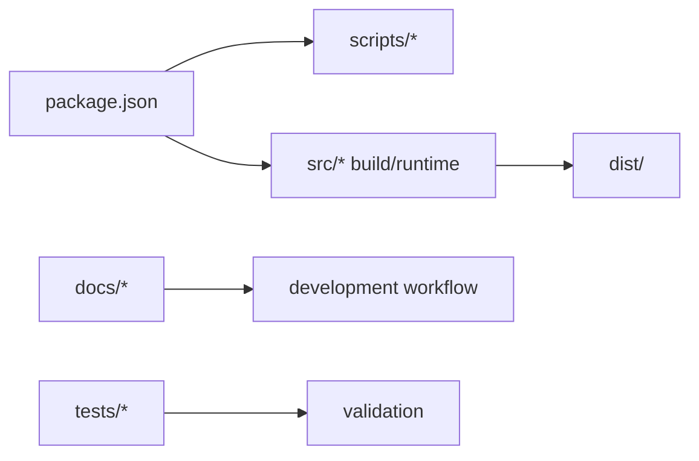

# Repository Overview / 仓库总览

## 1. 功能职责 (What / Why)
本仓库承载 DeckRogue 的运行时代码、设计文档、质量脚本、测试、静态资源与生成产物。整体组织遵循“功能导向”，而不是按文件后缀堆放。

## 2. 核心边界 (In / Out)
- In: 应用源码、脚本、文档、测试、资源。
- Out: 第三方依赖实现细节（`node_modules`）、Git 内部对象。

## 3. 主要文件清单 (Key Files)
- `package.json`: npm 入口与脚本定义。
- `tsconfig.json`: TypeScript 配置。
- `vite.config.ts`: 构建配置。
- `index.html`: Vite HTML 入口。
- `metadata.json`: 应用元数据声明。
- `src/`: 运行时代码。
- `docs/`: 文档知识库。
- `scripts/`: 分析/校验/资源工具。
- `tests/`: 自动化测试。
- `dist/`: 构建产物目录。

## 4. 模块关系 (Dependencies)
- 上游：Node.js、Vite、React、TypeScript。
- 下游：开发、构建、CI、本地调试。

## 5. 关键结构流 (Flow)

## 6. 对外接口 (Public Interface)
- 开发启动：`npm run dev`
- 类型检查：`npm run lint`
- 构建：`npm run build`
- 数值诊断：`npm run diag:numeric`
- 导入边界检查：`npm run check:import-boundaries`

## 7. 约束与禁忌 (Constraints)
- 运行时代码必须放在 `src/`。
- 文档、报告、计划不得继续散落在根目录。
- 根目录仅保留工具链入口与顶层功能分区。
- `metadata.json` 属于根级应用元数据，不应迁入 `src/content/`。

## 8. 迁移与兼容 (Migration)
- 根目录散落 Markdown 已迁移到 `docs/*`。
- 脚本已拆分到 `scripts/analysis|validation|assets`。
- 测试已拆分到 `tests/unit`。
- `src/engine/*` 与 `src/App.tsx` 仍保留兼容层。

## 9. 测试入口与验证命令
- `npm run lint`
- `npm run build`
- `npm run check:import-boundaries`
- `npm run check:deprecated-imports`
- `npm run check:readme-consistency`
