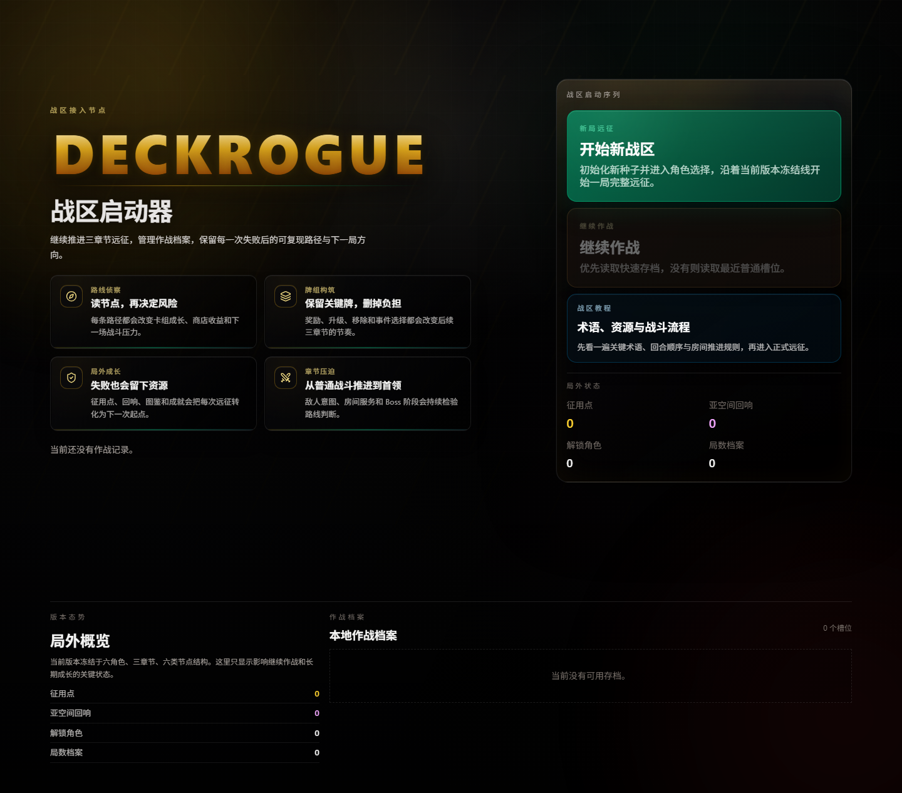
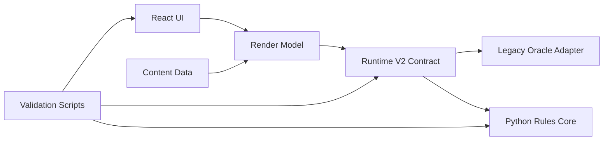

# DeckRogue

> 哥特战区牌组构筑原型。React + TypeScript 前端、Runtime V2 契约层、Python 规则核心和一组可重复的质量门禁共同维护这条主线。

[](https://www.typescriptlang.org/)
[](https://react.dev/)
[](https://vite.dev/)
[](https://www.electronjs.org/)
[](docs/contracts/runtime-v2.md)



## 1. 功能职责

DeckRogue 是一个以路线判断、牌组成长和战斗验证为核心的 deckbuilding roguelite 工程仓库。它不仅保存游戏本体，也保存围绕运行时迁移、内容校验、桌面打包、截图 smoke 和发布 readiness 的工程证据。

适合快速了解的入口：

- `src/`: 游戏 UI、核心事件系统、Runtime V2 桥接和渲染模型。
- `python_runtime/`: Python 规则核心与可重复运行的规则测试。
- `scripts/validation/`: 内容、运行时、UI、桌面和发布门禁。
- `tests/unit/`: Runtime V2、UI contract、内容约束和流程回归。
- `docs/`: 架构、契约、设计、环境和开发记录。

## 2. 核心边界

- In: 应用源码、规则核心、内容数据、测试、验证脚本、文档和仓库展示资源。
- Out: `node_modules`、`dist` 构建输出、临时截图缓存和 Git 内部对象。
- 运行时主线：React shell 负责呈现，Runtime V2 contract 负责稳定接口，Python rules core 负责可迁移规则语义。

## 3. 主要文件清单

| 路径 | 作用 |
| --- | --- |
| `package.json` | npm 脚本、依赖和验证入口 |
| `src/` | 前端、核心事件、Runtime V2、UI 视图 |
| `python_runtime/` | Python 规则核心和 unittest |
| `scripts/validation/` | smoke、release、content、security 检查 |
| `docs/contracts/runtime-v2.md` | Runtime V2 契约说明 |
| `docs/architecture/ARCHITECTURE.md` | 架构边界和模块关系 |
| `project-development-report.md` | 当前工作区 canonical 开发报告 |

## 4. 模块关系



## 5. 体验亮点

- 路线侦察：地图节点、商店、事件和奖励都会影响后续路线倾向。
- 牌组构筑：奖励、升级、移除、附魔和遗物升级共同塑造三章节节奏。
- Runtime V2：同一渲染模型可接入 legacy oracle、Python process 和 Python WASM 适配。
- 质量门禁：UI smoke、runtime parity、content authoring、desktop evidence 和 release readiness 串联成可审计发布链。

## 6. 对外接口

```powershell
npm install
npm run dev
npm run lint --silent
npm run build
npm run test:runtime-v2:ts
npm run test:supplemental-units
npm run test:ui-smoke
```

Windows Python 规则核心验证：

```powershell
$env:PYTHONPATH = "python_runtime/src"
py -m unittest discover -s python_runtime/tests -p "test_*.py"
Remove-Item Env:\PYTHONPATH
```

## 7. 约束与禁忌

- 根 README 同时承担 GitHub 门面和仓库结构索引，更新时必须保留本 1-9 节结构。
- 不新增依赖来装饰仓库门面；优先使用现有截图、文档和 shields badge。
- UI、Runtime V2、Python runtime 和 release gate 改动要配套测试或报告证据。
- 不把临时构建产物提交为主线证据；展示截图放入 `docs/github/`。

## 8. 迁移与兼容

- 当前主线正在从 legacy engine 逐步迁移到 Runtime V2 contract-first 结构。
- 桌面端通过 Electron 打包，并包含 Pyodide/Python WASM 运行资源检查。
- 旧脚本和历史报告保留在文档/验证分区内，避免根目录继续膨胀。

## 9. 测试入口

常用验证组合：

- 轻量提交：`npm run lint --silent` + `npm run build`
- Runtime 改动：`npm run test:runtime-v2:ts`
- UI 改动：`npm run test:ui-smoke`
- 发布证据：`npm run doctor:game` + `npm run check:release-readiness`

本仓库的门面截图来自真实 UI smoke：`docs/github/launcher-preview.png`。
