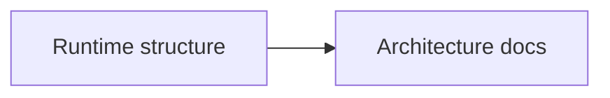

# docs/architecture / Architecture Documents

## 1. 功能职责 (What / Why)
存放系统架构层面的长期文档。

## 2. 核心边界
- In: 架构说明、模块关系。
- Out: 临时计划与报告。

## 3. 主要文件清单
- `ARCHITECTURE.md`: 体系结构说明。

## 4. 模块关系
- 上游：源代码现状。
- 下游：重构决策与维护工作。

## 5. 调用流

## 6. 对外接口
- 无代码接口。

## 7. 约束与禁忌
- 避免记录过时路径。

## 8. 迁移与兼容
- 从根目录 `ARCHITECTURE.md` 迁入。

## 9. 测试入口与验证命令
- `npm run check:readme-consistency`
