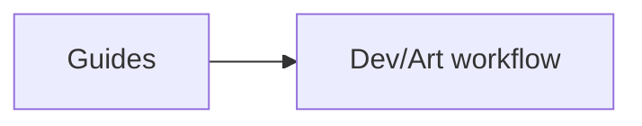

# docs/guides / Guides

## 1. 功能职责 (What / Why)
存放面向开发/美术/集成的操作指南。

## 2. 核心边界
- In: 操作步骤、实现建议、接入说明。
- Out: 审计报告与正式架构定义。

## 3. 主要文件清单
- `ART_GENERATION_GUIDE.md`
- `ORIGINAL_GOTHIC_IMPLEMENTATION_GUIDE.md`
- `asset_generation.md`
- `map_background_setup.md`
- `map_icons_setup.md`

## 4. 模块关系
- 上游：设计和工具链。
- 下游：资源生产与接入流程。

## 5. 调用流

## 6. 对外接口
- 无代码接口。

## 7. 约束与禁忌
- 指南应与当前目录结构保持一致。

## 8. 迁移与兼容
- 多个根目录和 `docs/` 散落指南已归并到此。

## 9. 测试入口与验证命令
- `npm run check:readme-consistency`
