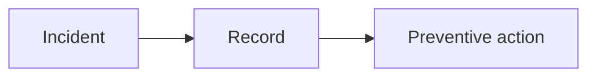

# docs/incidents / Incident Records

## 1. 功能职责 (What / Why)
记录具体时间点的故障、事故和处理过程。

## 2. 核心边界
- In: 故障记录与处理追踪。
- Out: 常规开发指南。

## 3. 主要文件清单
- `incident_report_2026-02-25.md`

## 4. 模块关系
- 上游：运行/开发事故。
- 下游：复盘与流程改进。

## 5. 调用流

## 6. 对外接口
- 无。

## 7. 约束与禁忌
- 事故记录应包含时间和上下文。

## 8. 迁移与兼容
- 已从 `docs/` 根层归位。

## 9. 测试入口与验证命令
- `npm run check:readme-consistency`
