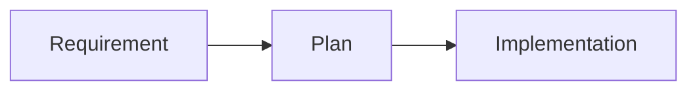

# docs/plans / Plans

## 1. 功能职责 (What / Why)
存放实施计划与阶段执行方案。

## 2. 核心边界
- In: 规划与迁移方案。
- Out: 结果报告。

## 3. 主要文件清单
- `PLAN.md`

## 4. 模块关系
- 上游：需求输入。
- 下游：执行实现与报告。

## 5. 调用流

## 6. 对外接口
- 无。

## 7. 约束与禁忌
- 计划文档不应替代最终实现文档。

## 8. 迁移与兼容
- 从根目录迁入。

## 9. 测试入口与验证命令
- `npm run check:readme-consistency`
