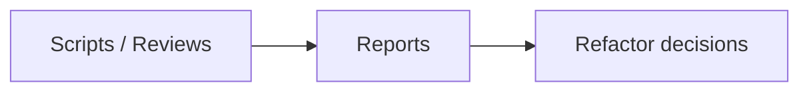

# docs/reports / Reports

## 1. 功能职责 (What / Why)
集中放置审查、修复、数值分析与平衡报告。

## 2. 核心边界
- In: 各类输出报告。
- Out: 指南与长期架构文档。

## 3. 主要文件清单
- `balance_report.md`
- `balance_test_report.md`
- `development/README.md`
- `development/development_report_2026-03-06.md`
- `engine_fix_report.md`
- `engine_review_report.md`
- `numerical-system-audit.md`
- `ui_fix_report.md`
- `ui_review_report.md`

## 4. 模块关系
- 上游：脚本分析、人工审查。
- 下游：重构与修复决策。

## 5. 调用流

## 6. 对外接口
- 无。

## 7. 约束与禁忌
- 报告命名应体现主题与时间。

## 8. 迁移与兼容
- 根目录与 `reports/` 内容已并入本目录。

## 9. 测试入口与验证命令
- `npm run check:readme-consistency`
