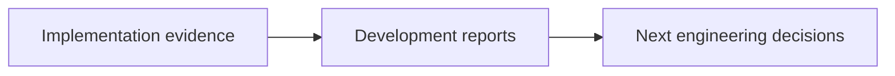

# docs/reports/development / Development Reports

## 1. 功能职责 (What / Why)
集中放置开发过程、工程重构、实现复盘、技术白皮书与阶段性总结报告。

## 2. 核心边界
- In: 架构重构报告、阶段复盘、工程论文式总结。
- Out: 数值报告、UI 审查、引擎缺陷专项报告。

## 3. 主要文件清单
- `development_report_2026-03-06.md`: 当前最新版项目复盘与技术白皮书。

## 4. 模块关系
- 上游：`progress.md`、`docs/DEVELOPMENT.md`、构建日志、验证脚本。
- 下游：后续重构决策、项目归档与对外说明。

## 5. 调用流

## 6. 对外接口
- 无。

## 7. 约束与禁忌
- 开发报告必须以仓库当前实现为准。
- 历史文档如果与当前实现冲突，必须明确标注为“背景材料”而不是“现状事实”。

## 8. 迁移与兼容
- 旧的根级开发报告已迁入本子目录统一管理。

## 9. 测试入口与验证命令
- `npm run check:readme-consistency`
