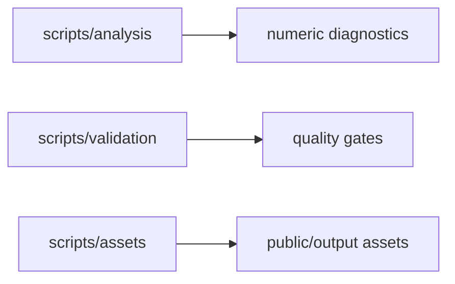

# scripts / Operational Tooling

## 1. 功能职责 (What / Why)
承载仓库外部工具脚本，按功能分为分析、校验、资产处理三类。

## 2. 核心边界 (In / Out)
- In: 诊断、质量门禁、资产加工。
- Out: 应用运行时主逻辑。

## 3. 主要文件清单 (Key Files)
- `analysis/`: 数值分析与平衡模拟。
- `validation/`: 导入边界、deprecated、README、CI 扫描。
- `assets/`: 资源生成与切片工具。

## 4. 模块关系 (Dependencies)
- 上游：`src/` 源代码与 `public/` 资源。
- 下游：CI、本地维护流程。

## 5. 调用流

## 6. 对外接口
- npm scripts defined in `package.json`

## 7. 约束与禁忌
- 脚本不应替代运行时代码。
- 路径调整后需同步 `package.json`。

## 8. 迁移与兼容
- 根目录 `scripts/*.ts` 已拆分为子分区。

## 9. 测试入口与验证命令
- `npm run diag:numeric`
- `npm run check:import-boundaries`
- `npm run check:deprecated-imports`
- `npm run check:readme-consistency`
