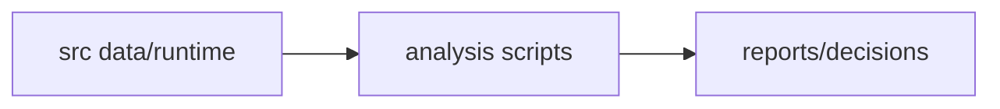

# scripts/analysis / Analysis Scripts

## 1. 功能职责 (What / Why)
提供数值诊断、平衡模拟和阶段性重平衡脚本。

## 2. 核心边界
- In: 只读分析与模拟。
- Out: 运行时主逻辑。

## 3. 主要文件清单
- `balance_test.ts`
- `numeric_diagnostics.ts`
- `simulate_early_balance.ts`
- `rebalance_from_skills.cjs`

## 4. 模块关系
- 上游：`src/` 和 `docs/design/skills.md`
- 下游：`docs/reports/`

## 5. 调用流

## 6. 对外接口
- `npm run diag:numeric`

## 7. 约束与禁忌
- 分析脚本不可默默修改核心数据，除非显式声明。

## 8. 迁移与兼容
- 从 `scripts/` 根层拆分迁入。

## 9. 测试入口与验证命令
- `npm run diag:numeric`
