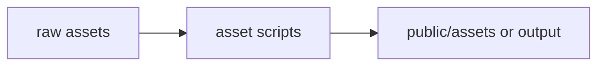

# scripts/assets / Asset Scripts

## 1. 功能职责 (What / Why)
存放图标、占位图和资源生成/加工脚本。

## 2. 核心边界
- In: 资源生成与切片。
- Out: 应用运行时。

## 3. 主要文件清单
- `generate-map-icons.js`
- `generate_art.cjs`
- `setup_map_icons.py`

## 4. 模块关系
- 上游：设计输入、原始素材。
- 下游：`public/assets`, `output/`

## 5. 调用流

## 6. 对外接口
- 手工执行脚本；当前未全部接入 npm script。

## 7. 约束与禁忌
- 运行前需检查输入/输出路径是否和当前仓库结构一致。

## 8. 迁移与兼容
- 从 `scripts/` 根层拆入本目录。

## 9. 测试入口与验证命令
- 按需手工执行。
