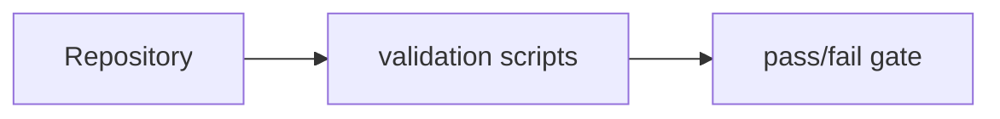

# scripts/validation / Validation Scripts

## 1. 功能职责 (What / Why)
提供仓库结构、导入边界、deprecated 使用与 CI 审核检查。

## 2. 核心边界
- In: 质量门禁。
- Out: 业务逻辑执行。

## 3. 主要文件清单
- `check_import_boundaries.ts`
- `check_deprecated_imports.ts`
- `check_readme_consistency.ts`
- `check_github_transport.ts`
- `check_event_tradeoff_route_state.ts`
- `check_midgame_route_sustain.ts`
- `dead_file_scan.ts`
- `run_python_runtime_tests.ts`
- `review_ci.ts`
- `repair_macos_native_modules.sh`

## 4. 模块关系
- 上游：全仓库文件结构。
- 下游：CI、维护流程。

## 5. 调用流

## 6. 对外接口
- `npm run check:import-boundaries`
- `npm run check:deprecated-imports`
- `npm run check:readme-consistency`
- `npm run check:github-transport`
- `npm run check:event-tradeoff-route-state`
- `npm run check:midgame-route-sustain`
- `npm run test:python-runtime`
- `npm run scan:dead`
- `npm run review:ci`
- `npm run repair:macos-native`
- `npm run check:github-transport`

## 7. 约束与禁忌
- 校验规则变化必须同步文档。

## 8. 迁移与兼容
- 从根层 `scripts/` 拆入本目录。

## 9. 测试入口与验证命令
- 同上。
