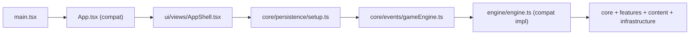

# src 总览 / Source Overview

## 1. 功能职责 (What / Why)
`src/` 采用“功能实现导向”分层：`core` 负责规则引擎，`features` 负责玩法模块，`content` 负责数据内容，`ui` 负责表现层，`infrastructure` 提供底层技术能力。

## 2. 核心边界 (In Scope / Out of Scope)
- In scope: 游戏运行逻辑、内容定义、UI 渲染、随机数与持久化。
- Out of scope: 构建产物、外部脚本输出、设计稿源文件。

## 3. 主要文件清单 (Key Files)
- `main.tsx`: React/Vite 入口与初始化挂载。
- `App.tsx`: 兼容壳（转发到 `@/ui/views/AppShell`）。
- `core/persistence/setup.ts`: 运行期生命周期管理。
- `engine/index.ts`: 兼容门面（deprecated re-export）。

## 4. 模块关系 (Dependencies)
- 上游依赖：Vite/React、浏览器运行时。
- 下游被依赖：`scripts/*`、`tests/*`、UI 场景流程。

## 5. 关键数据流/调用流 (Flow)

## 6. 对外接口 (Public Interfaces)
- 入口：`main.tsx`
- 兼容入口：`App.tsx`、`engine/index.ts`
- 规范导入：`@/core/*`、`@/features/*`、`@/content/*`、`@/ui/*`、`@/infrastructure/*`

## 7. 约束与禁忌 (Constraints)
- 禁止在业务代码新增 `@/engine/*` 依赖。
- 禁止 UI 直接拼接业务规则；规则应来自 `core/features/content`。
- 禁止跨层引用私有实现文件，优先使用分区公开入口。

## 8. 迁移与兼容说明 (Migration / Compatibility)
### 旧路径 -> 新路径映射
| 旧路径 | 新路径 |
|---|---|
| `@/core/events/gameEngine` | `@/core/events/gameEngine` (业务主路径) |
| `@/engine/index` | `@/engine/index` (兼容门面) |
| `src/App.tsx` 实现 | `@/ui/views/AppShell` |
| `../content/characters.json` | `@/content/data/characters.json` |

兼容期：一个主版本周期；兼容结束后删除 `engine` 旧导入。

## 9. 测试入口与验证命令 (Validation)
- `npm run lint`
- `npm run build`
- `npm run check:import-boundaries`
- `npm run check:deprecated-imports`

## 开发总文档 / Development Canon
- 总开发规范：`/Users/zhuhangcheng/Downloads/好玩/deckrogue/docs/DEVELOPMENT.md`
