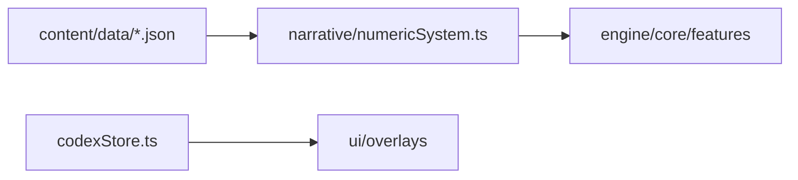

# content 模块 / Content Domain

## 1. 功能职责
承载所有静态游戏数据与叙事装配逻辑，提供“可配置内容层”。

## 2. 核心边界
- In: JSON 定义、叙事事件、内容解释与装配。
- Out: 战斗实时结算与 UI 交互状态。

## 3. 主要文件清单
- `data/*.json`: 卡牌、敌人、遗物、药水、世界观等静态定义。
- `narrative/numericSystem.ts`: 统一数据读取与运行时筛选。
- `narrative/storyEvents.ts`: 事件定义。
- `codexStore.ts`: 图鉴存档读写。

## 4. 模块关系
- 上游：无（内容源头）。
- 下游：`core/*`, `features/*`, `ui/*`。

## 5. 调用流

## 6. 对外接口
- `cardsData/enemiesData/...`（来自 `numericSystem`）
- `STORY_EVENTS`
- `unlockCodexEntry` 等图鉴 API

## 7. 约束与禁忌
- 禁止在 UI 中写入内容规则分支，应通过本层导出。

## 8. 迁移与兼容
- 旧 `src/content/*.json` 路径统一迁到 `src/content/data/*.json`。

## 9. 测试入口与验证命令
- `npm run lint`
- `npm run diag:numeric`
