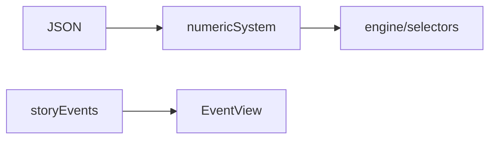

# content/narrative / 叙事与装配层

## 1. 功能职责
对静态内容进行可运行装配：事件池、数值配置读取、按规则筛选。

## 2. 核心边界
- In: 数据聚合、事件定义、叙事文本。
- Out: 引擎状态推进与 UI 控件渲染。

## 3. 主要文件清单
- `numericSystem.ts`: 内容数据装配与运行时查询。
- `storyEvents.ts`: 故事事件定义。

## 4. 模块关系
- 上游：`content/data/*.json`。
- 下游：`engine/engine.ts`, `features/*`。

## 5. 调用流

## 6. 对外接口
- `cardsData`, `enemiesData`, `relicsData`, `potionsData`
- `STORY_EVENTS`, `getStoryEventDef`

## 7. 约束与禁忌
- 禁止在 narrative 层修改玩家战斗状态。

## 8. 迁移与兼容
- 所有运行时内容读取统一经本层，不再直接散读 JSON。

## 9. 测试入口与验证命令
- `npm run lint`
- 事件烟测：Map->Event->Choice
