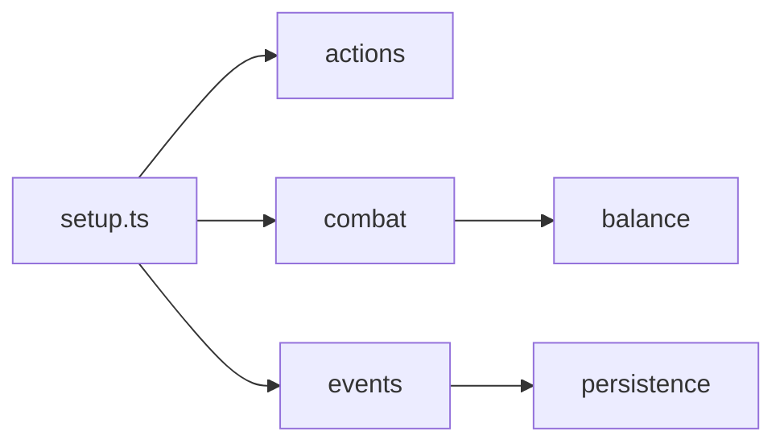

# core 模块 / Core Systems

## 1. 功能职责 (What / Why)
`core/` 承载战斗、动作、事件、平衡、存档等系统级规则，是运行时的稳定内核。

## 2. 核心边界 (In / Out)
- In: 规则计算、状态推进、生命周期管理。
- Out: 玩法内容定义（`features`）、静态数据（`content`）、视觉表现（`ui`）。

## 3. 主要文件清单 (Key Files)
- `index.ts`: core 顶层统一导出入口，供 `@/core` 使用。
- `types.ts`: 核心共享类型聚合口径。
- `actions/index.ts`, `balance/index.ts`, `combat/index.ts`, `events/index.ts`, `persistence/index.ts`: 子分区统一出口。
- 子分区：`combat/`、`actions/`、`balance/`、`events/`、`persistence/`。

## 4. 模块关系 (Dependencies)
- 上游依赖：`content/*` 的数据结构、`infrastructure/rng/*`。
- 下游被依赖：`engine/engine.ts`、`ui/views/*`、`features/*`。

## 5. 调用流 (Flow)

## 6. 对外接口 (Public API)
- 通过 `@/core/index` 与子模块公开接口。
- 核心类型统一来自 `@/core/types`。

## 7. 约束与禁忌 (Constraints)
- 不在 `core` 引入 `ui`。
- 不把内容静态配置硬编码进系统公式。

## 8. 迁移与兼容 (Migration)
- 原 `engine/*` 中规则实现逐步迁移至 `core/*`。
- 兼容阶段仍可通过 `@/core/events/gameEngine` 转发访问。

## 9. 测试入口与验证命令
- `npm run lint`
- `npm run test:damage`
