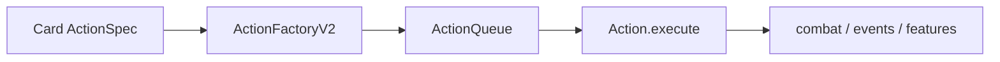

# core/actions / 动作系统

## 1. 功能职责
以队列 + 管理器 + ActionFactory 组织卡牌/遗物/系统动作执行。

## 2. 核心边界
- In: 动作入队、优先级、上下文传播、动作实例化。
- Out: 具体数值公式（由 combat/balance 提供）。

## 3. 主要文件清单
- `actionQueue.ts`: 动作队列与执行循环。
- `actionManager.ts`: 统一入队管理与生命周期。
- `v2/ActionFactory.ts`: 动作类型到实现映射。
- `v2/DamageActions.ts`: 伤害/抽牌/资源动作。
- `v2/SpecialActions.ts`: 特殊机制动作。
- `v2/WarpActions.ts`: Warp Tide 相关动作。

## 4. 模块关系
- 上游：`core/types`、`core/combat/targetingService`。
- 下游：`engine/engine.ts`、`features/relics/relicSystem.ts`。

## 5. 调用流

## 6. 对外接口
- `ActionQueue`, `globalActionQueue`
- `ActionManager`, `createActionManager`
- `ActionFactoryV2`, `setupActionManager`

## 7. 约束与禁忌
- 禁止直接变更 UI 状态。
- 禁止绕过队列直接执行复杂连锁动作。

## 8. 迁移与兼容
- 旧入口 `@/core/events/gameEngine` 已转发到本分区。

## 9. 测试入口与验证命令
- `npm run lint`
- `npm run test:damage`
