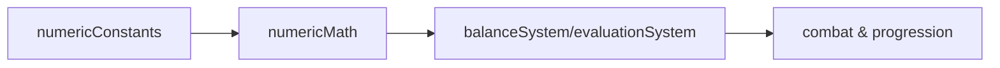

# core/balance / 数值与平衡系统

## 1. 功能职责
提供数值常量、评估模型、经济/强度平衡辅助计算。

## 2. 核心边界
- In: 常量、公式、评估指标。
- Out: 运行时动作编排与 UI 解释。

## 3. 主要文件清单
- `numericConstants.ts`: 常量配置。
- `numericMath.ts`: 基础数学工具与伤害步进函数。
- `balanceSystem.ts`: 平衡计算入口。
- `evaluationSystem.ts`: 评估体系。
- `metaBalance.ts`: 元进度平衡参数。

## 4. 模块关系
- 上游：`content/data/metaBalance.json`。
- 下游：`combatSystem`、`economySystem`、`engine`。

## 5. 调用流

## 6. 对外接口
- `COMBAT_NUMBERS`, `BALANCE_CONSTANTS`, `ECONOMY_DEFAULTS`
- `balanceSystem`, `evaluationSystem`, `metaBalance`

## 7. 约束与禁忌
- 禁止在公式中硬编码 UI 文案或场景判定。
- 禁止跨层读取 `ui/*`。

## 8. 迁移与兼容
- 旧 `engine/balance*` 已由兼容门面转发。

## 9. 测试入口与验证命令
- `npm run lint`
- `npm run diag:numeric`
