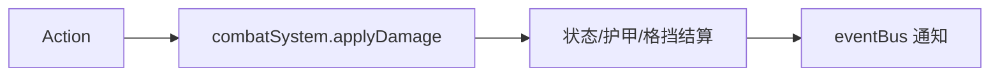

# core/combat / 战斗系统

## 1. 功能职责
处理伤害、状态、格挡、护甲等即时战斗结算。

## 2. 核心边界
- In: 伤害管道、状态应用、单位受击。
- Out: 卡牌动作编排（`core/actions`）、奖励与经济。

## 3. 主要文件清单
- `combatSystem.ts`: 战斗数值结算核心实现。

## 4. 模块关系
- 上游：`core/types`、`core/balance/numericConstants`。
- 下游：`core/actions/v2/*`、`features/relics/relicSystem.ts`。

## 5. 调用流

## 6. 对外接口
- `combatSystem`
- `CombatSystem`
- `DamageContext`
- `DamageModifier`

## 7. 约束与禁忌
- 禁止在此层处理 UI 文案。
- 禁止直接读取 JSON 文件。

## 8. 迁移与兼容
- 兼容导出：`@/core/events/gameEngine` -> `@/core/combat/combatSystem`。

## 9. 测试入口与验证命令
- `npm run test:damage`
- `npm run lint`
