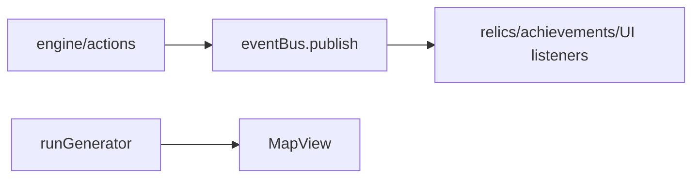

# core/events / 事件系统

## 1. 功能职责
统一管理事件总线、Boss 阶段、地图生成与 run summary 统计。

## 2. 核心边界
- In: 发布/订阅、流程事件、run 级别汇总。
- Out: UI 弹窗实现、具体动作执行。

## 3. 主要文件清单
- `eventBus.ts`: 全局事件总线。
- `bossPhaseSystem.ts`: Boss 分阶段规则。
- `runGenerator.ts`: 地图节点生成。
- `runSummarySystem.ts`: 结算统计。

## 4. 模块关系
- 上游：`core/types`。
- 下游：`engine`, `features/relics`, `ui/views`。

## 5. 调用流

## 6. 对外接口
- `globalEventBus`, `EventBus`
- `runGenerator`, `RunGenerator`
- `computeRunSummary`

## 7. 约束与禁忌
- 事件应保持幂等，避免副作用在订阅端重复触发。

## 8. 迁移与兼容
- `@/core/events/gameEngine` 保留事件相关转发。

## 9. 测试入口与验证命令
- `npm run lint`
- 地图烟测：角色选择 -> Map 可选路由
