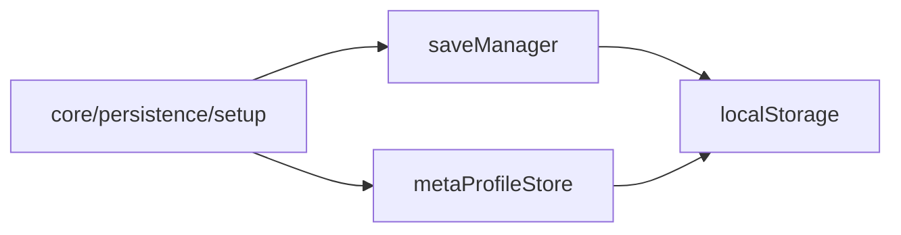

# core/persistence / 存档系统

## 1. 功能职责
管理运行存档、快照、元进度与读写校验。

## 2. 核心边界
- In: 存档格式、序列化、元档案更新。
- Out: 战斗结算公式、UI 呈现。

## 3. 主要文件清单
- `saveManager.ts`: run 存档读写。
- `metaProfileStore.ts`: 元进度档案读写。

## 4. 模块关系
- 上游：`core/types`, `core/events`。
- 下游：`core/persistence/setup`, `ui/views/AppShell`。

## 5. 调用流

## 6. 对外接口
- `saveManager`, `SaveManager`
- `loadMetaProfile`, `saveMetaProfile`, `applyRunSummaryToMetaProfile`

## 7. 约束与禁忌
- 禁止在存档层引入视图组件。
- 存档版本变更必须提供迁移。

## 8. 迁移与兼容
- 旧 `engine/saveManager`、`engine/metaProfileStore` 由兼容门面转发。

## 9. 测试入口与验证命令
- `npm run lint`
- 运行烟测：Quick Save / Quick Load
