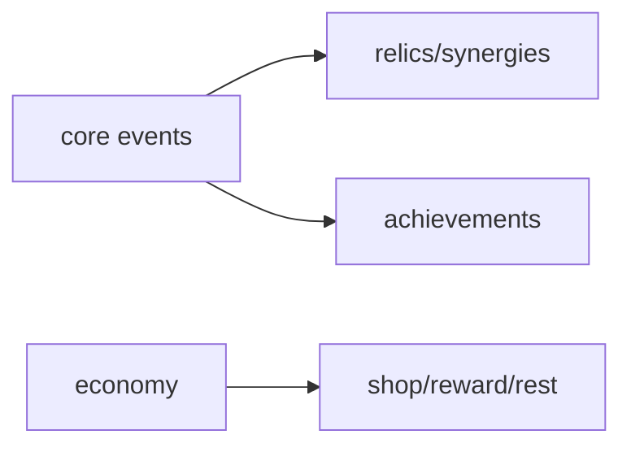

# features 模块 / Gameplay Features

## 1. 功能职责
`features/` 承载可组合玩法系统（成就、遗物、协同、进度经济），在 core 规则之上实现“可玩性”。

## 2. 核心边界
- In: 玩法规则、触发策略、奖励推进。
- Out: 底层结算管道（`core`）与静态定义文件（`content/data`）。

## 3. 主要文件清单
- `achievements/achievementSystem.ts`
- `relics/relicSystem.ts`
- `synergies/synergySystem.ts`
- `progression/economySystem.ts`

## 4. 模块关系
- 上游：`core/events`, `core/combat`, `content/narrative`。
- 下游：`engine`, `ui/views`。

## 5. 调用流

## 6. 对外接口
通过各子目录导出系统单例或函数集。

## 7. 约束与禁忌
- 禁止 features 直接改写 UI 组件状态。
- 禁止跨 features 直接耦合私有实现。

## 8. 迁移与兼容
旧 `engine/relicSystem` 等路径已由 `@/core/events/gameEngine` 转发。

## 9. 测试入口与验证命令
- `npm run lint`
- `npm run diag:numeric`
