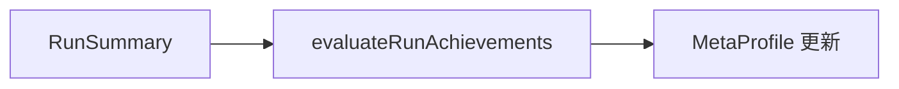

# features/achievements / 成就系统

## 1. 功能职责
评估 run 内行为并产生成就解锁结果。

## 2. 核心边界
- In: 成就定义读取、条件评估、结果汇总。
- Out: 成就 UI 展示。

## 3. 主要文件清单
- `achievementSystem.ts`: 成就定义查询与评估入口。

## 4. 模块关系
- 上游：`content/data/achievements.json`, `core/types`。
- 下游：`ui/overlays/AchievementOverlay.tsx`。

## 5. 调用流

## 6. 对外接口
- `getAchievementDefs`
- `getAchievementDefById`
- `evaluateRunAchievements`
- `getAchievementUnlockedCount`

## 7. 约束与禁忌
- 不在这里写本地存储读写细节。

## 8. 迁移与兼容
- 旧路径：`engine/achievementSystem` -> 新路径本目录。

## 9. 测试入口与验证命令
- `npm run lint`
