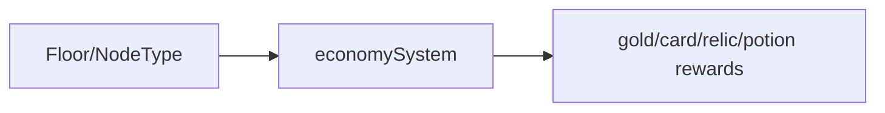

# features/progression / 进度经济系统

## 1. 功能职责
控制金币、掉落、商店价格、战斗奖励与楼层曲线。

## 2. 核心边界
- In: 经济与成长曲线。
- Out: 战斗细节与 UI 决策。

## 3. 主要文件清单
- `economySystem.ts`: 经济模型主实现。

## 4. 模块关系
- 上游：`core/balance/numericConstants`。
- 下游：`engine` 的奖励与商店流程。

## 5. 调用流

## 6. 对外接口
- `economySystem`, `EconomySystem`
- `calculateCombatRewards`, `calculateShopPrices`

## 7. 约束与禁忌
- 禁止把单次运行临时状态硬编码进全局经济模型。

## 8. 迁移与兼容
- `engine/economySystem` -> 本目录（兼容门面保留）。

## 9. 测试入口与验证命令
- `npm run diag:numeric`
- `npm run lint`
