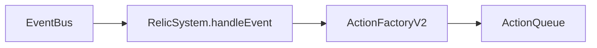

# features/relics / 遗物系统

## 1. 功能职责
管理遗物触发器、状态成长/腐化、副作用与事件联动。

## 2. 核心边界
- In: 遗物效果注册、触发分发、获取/移除逻辑。
- Out: 遗物美术与 Tooltip UI 细节。

## 3. 主要文件清单
- `relicSystem.ts`: 遗物效果核心。

## 4. 模块关系
- 上游：`core/events/eventBus`, `core/actions`。
- 下游：`engine/engine.ts`, `ui/overlays/CodexOverlay.tsx`。

## 5. 调用流

## 6. 对外接口
- `relicSystem`, `RelicSystem`
- `addRelic`, `removeRelic`, `hasRelic`

## 7. 约束与禁忌
- 遗物副作用必须显式可追踪（事件或状态字段）。

## 8. 迁移与兼容
- 旧路径保留在 `@/core/events/gameEngine`，标注 deprecated。

## 9. 测试入口与验证命令
- `npm run lint`
- 战斗烟测：携带遗物开战触发
