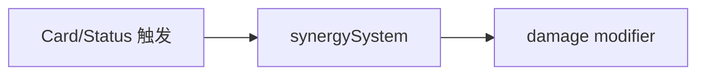

# features/synergies / 协同系统

## 1. 功能职责
跟踪并计算跨卡牌/状态/流派组合收益。

## 2. 核心边界
- In: 协同状态寄存、战斗内增益计算。
- Out: 卡牌定义与动作调度。

## 3. 主要文件清单
- `synergySystem.ts`: 协同计算与状态管理。

## 4. 模块关系
- 上游：`core/types`, `core/combat/combatSystem`。
- 下游：`combatSystem.calculateDamage`, `tests/damageCalculation.test.ts`。

## 5. 调用流

## 6. 对外接口
- `synergySystem`, `SynergySystem`
- `resetAll` 等状态管理函数

## 7. 约束与禁忌
- 禁止在协同层直接发 UI 事件。

## 8. 迁移与兼容
- `engine/synergySystem` 已兼容转发。

## 9. 测试入口与验证命令
- `npm run test:damage`
- `npm run lint`
