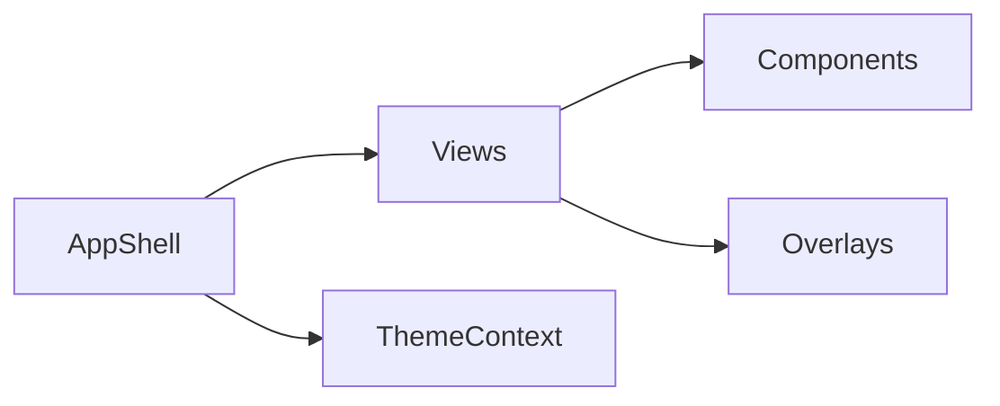

# ui 模块 / UI Layer

## 1. 功能职责
负责视图呈现、交互反馈、主题控制与覆盖层。

## 2. 核心边界
- In: 页面组件、可复用 UI、主题与视觉效果。
- Out: 业务规则与数值结算。

## 3. 主要文件清单
- `views/AppShell.tsx`: 主壳场景编排。
- `launcher/SetupLauncher.tsx`: 正式启动器入口。
- `views/*.tsx`: 各场景页面。
- `components/*`: 复用视觉组件。
- `overlays/*`: 全局覆盖层。
- `theme/ThemeContext.tsx`: 主题状态。

## 4. 模块关系
- 上游：`core/persistence/setup`, `core/events/gameEngine.ts`。
- 下游：最终 DOM 渲染。

## 5. 调用流

## 6. 对外接口
- `AppShell`
- 各 View 组件与 Overlay 组件
- `ThemeProvider/useTheme`

## 7. 约束与禁忌
- 禁止在 UI 直接实现战斗公式。
- UI 访问引擎状态应通过公开字段/方法。

## 8. 迁移与兼容
- 主实现下沉至 `@/ui/views/AppShell`。
- `src/App.tsx` 保留兼容壳导出。

## 9. 测试入口与验证命令
- `npm run lint`
- `npm run dev` 手工全链路烟测
