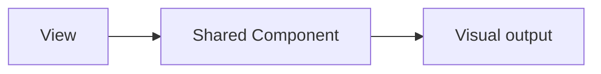

# ui/components / 共享 UI 组件

## 1. 功能职责
封装跨视图复用的基础显示组件与资源处理工具。

## 2. 核心边界
- In: 可复用展示组件、视觉辅助函数。
- Out: 页面级流程控制。

## 3. 主要文件清单
- `BackgroundImage.tsx`
- `MapIcon.tsx`
- `ViewBackgroundLayer.tsx`
- `assetHelpers.ts`
- `backgroundVisuals.ts`

## 4. 模块关系
- 上游：`ui/views/*`。
- 下游：DOM/CSS 呈现。

## 5. 调用流

## 6. 对外接口
- 组件 props
- `assetHelpers`、`backgroundVisuals` 工具函数

## 7. 约束与禁忌
- 不依赖业务层状态结构（除必要类型）。

## 8. 迁移与兼容
- 新组件统一使用 `@/ui/components/*`。

## 9. 测试入口与验证命令
- `npm run lint`
