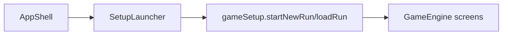

# ui/launcher / 启动器模块

## 1. 功能职责
提供正式启动器入口，用于新游戏、继续作战、读取存档，而不是依赖直接打开单页 HTML。

## 2. 核心边界
- In: 启动入口、存档选择、局外概览。
- Out: 战斗、地图、奖励等运行期页面逻辑。

## 3. 主要文件清单
- `SetupLauncher.tsx`: 启动器主界面。

## 4. 模块关系
- 上游：`@/core` 的 `gameSetup`、`SaveSlot`、`MetaProfile`
- 下游：`ui/views/AppShell.tsx`

## 5. 调用流

## 6. 对外接口
- `SetupLauncher`

## 7. 约束与禁忌
- 不在启动器中实现游戏规则。
- 启动器只负责进入、继续、读取和删除存档。

## 8. 迁移与兼容
- 新增一级启动入口模块，替代“页面初始化即自动开局”的单一路径。

## 9. 测试入口与验证命令
- `npm run dev`
- 启动器 -> 新游戏 / 继续 / 读取 存档烟测
