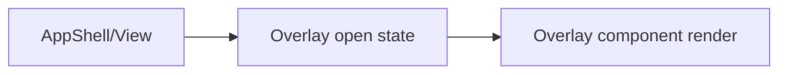

# ui/overlays / 覆盖层组件

## 1. 功能职责
承载全局弹层、提示、滤镜与图鉴/成就面板。

## 2. 核心边界
- In: 浮层展示、过渡动画、信息聚合。
- Out: 核心战斗决策。

## 3. 主要文件清单
- `AchievementOverlay.tsx`
- `CodexOverlay.tsx`
- `GlobalFilterOverlay.tsx`
- `WarpDeceptionText.tsx`
- `codexCatalog.ts`

## 4. 模块关系
- 上游：`ui/views/AppShell.tsx`, `core/persistence/codexStore.ts`。
- 下游：用户输入与可视反馈。

## 5. 调用流

## 6. 对外接口
各 overlay 组件 props 接口。

## 7. 约束与禁忌
- 禁止 overlay 直接写入核心状态，必须走引擎 API。

## 8. 迁移与兼容
- 无旧路径差异，保持组件名稳定。

## 9. 测试入口与验证命令
- `npm run dev` 手工验证 Overlay 开关与内容同步
