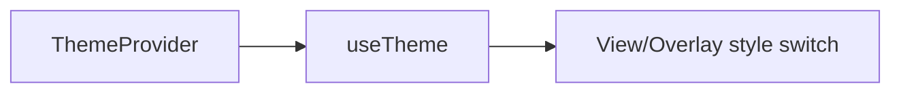

# ui/theme / 主题系统

## 1. 功能职责
统一管理主题模式、视觉强度与滤镜开关。

## 2. 核心边界
- In: 主题 context 与切换逻辑。
- Out: 游戏规则与持久化业务。

## 3. 主要文件清单
- `ThemeContext.tsx`: ThemeProvider + useTheme。

## 4. 模块关系
- 上游：`ui/views/AppShell.tsx`。
- 下游：所有使用主题样式的组件。

## 5. 调用流

## 6. 对外接口
- `ThemeProvider`
- `useTheme`

## 7. 约束与禁忌
- 禁止在 theme 层直接触发游戏状态更新。

## 8. 迁移与兼容
- 保持 API 稳定，兼容已有调用。

## 9. 测试入口与验证命令
- `npm run dev` 切换 dark/light 与滤镜
