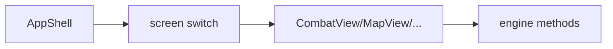

# ui/views / 场景视图

## 1. 功能职责
提供完整页面级视图：角色选择、地图、战斗、奖励、商店、事件等。

## 2. 核心边界
- In: 页面布局、交互动作触发。
- Out: 游戏规则实现。

## 3. 主要文件清单
- `AppShell.tsx`: 全局视图路由与状态壳。
- `CharacterSelectView.tsx`, `MapView.tsx`, `CombatView.tsx`
- `RewardView.tsx`, `ShopView.tsx`, `RestView.tsx`, `EventView.tsx`
- `UpgradeView.tsx`, `RemoveCardView.tsx`, `CardView.tsx`

## 4. 模块关系
- 上游：`core/events/gameEngine.ts`、`core/persistence/setup.ts`。
- 下游：`ui/components/*`, `ui/overlays/*`。

## 5. 调用流

## 6. 对外接口
各视图组件默认导出或命名导出供 `AppShell` 使用。

## 7. 约束与禁忌
- 禁止跨视图复制业务规则逻辑。

## 8. 迁移与兼容
- `src/App.tsx` -> `src/ui/views/AppShell.tsx`。

## 9. 测试入口与验证命令
- `npm run dev`：角色选择→地图→战斗→奖励→商店→篝火→事件
