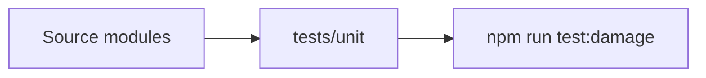

# tests / Test Suite

## 1. 功能职责 (What / Why)
提供自动化验证，当前以单元测试为主。

## 2. 核心边界 (In / Out)
- In: 单元测试、后续集成测试。
- Out: 手工烟测记录。

## 3. 主要文件清单 (Key Files)
- `unit/damageCalculation.test.ts`: 伤害计算基准测试。

## 4. 模块关系 (Dependencies)
- 上游：`src/core/combat/combatSystem.ts`, `src/features/synergies/synergySystem.ts`
- 下游：CI 与本地回归验证。

## 5. 调用流

## 6. 对外接口
- `npm run test:damage`

## 7. 约束与禁忌
- 测试路径调整后必须同步 npm script。

## 8. 迁移与兼容
- `tests/damageCalculation.test.ts` 已迁移到 `tests/unit/`。

## 9. 测试入口与验证命令
- `npm run test:damage`
