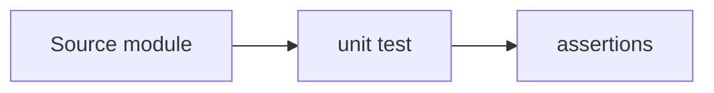

# tests/unit / Unit Tests

## 1. 功能职责 (What / Why)
承载单元级回归测试。

## 2. 核心边界
- In: 纯函数或可控模块测试。
- Out: 浏览器 E2E。

## 3. 主要文件清单
- `damageCalculation.test.ts`

## 4. 模块关系
- 上游：`src/core/combat`, `src/features/synergies`
- 下游：CI / 本地回归

## 5. 调用流

## 6. 对外接口
- `npm run test:damage`

## 7. 约束与禁忌
- 测试必须使用稳定可重复输入。

## 8. 迁移与兼容
- 由 `tests/` 根层迁移至 `tests/unit/`。

## 9. 测试入口与验证命令
- `npm run test:damage`
